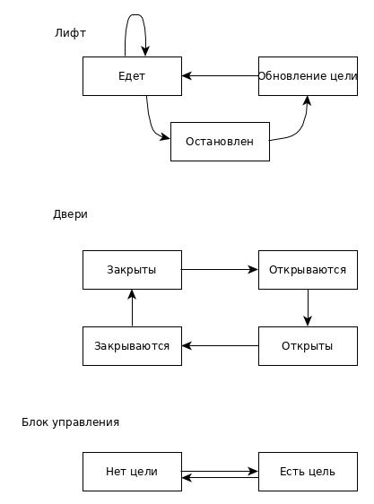

# Дисциплина "Объектно-ориентированное программирование" (2019)
## Лаб. №1
Реализация просмотрщика каркасной модели с помощью структурного подхода
## Лаб. №2
Реализация контейнерного шаблонного класса односвязного списка прямого доступа
## Лаб. №3
Моделирование работы лифта с помощью паттерна издатель-подписчик (Observer)

Модель состояний

